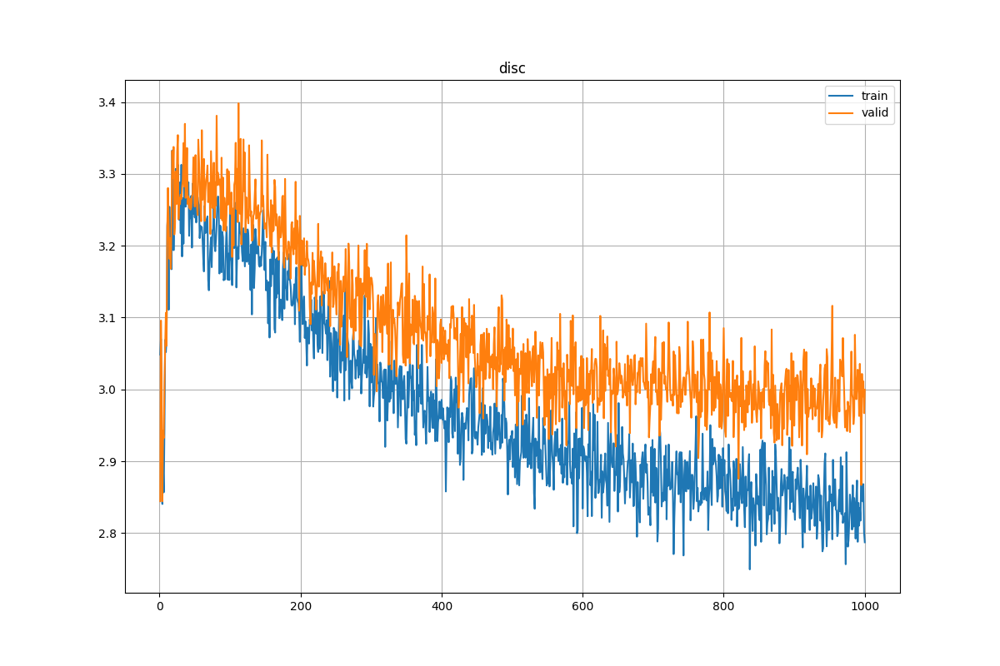
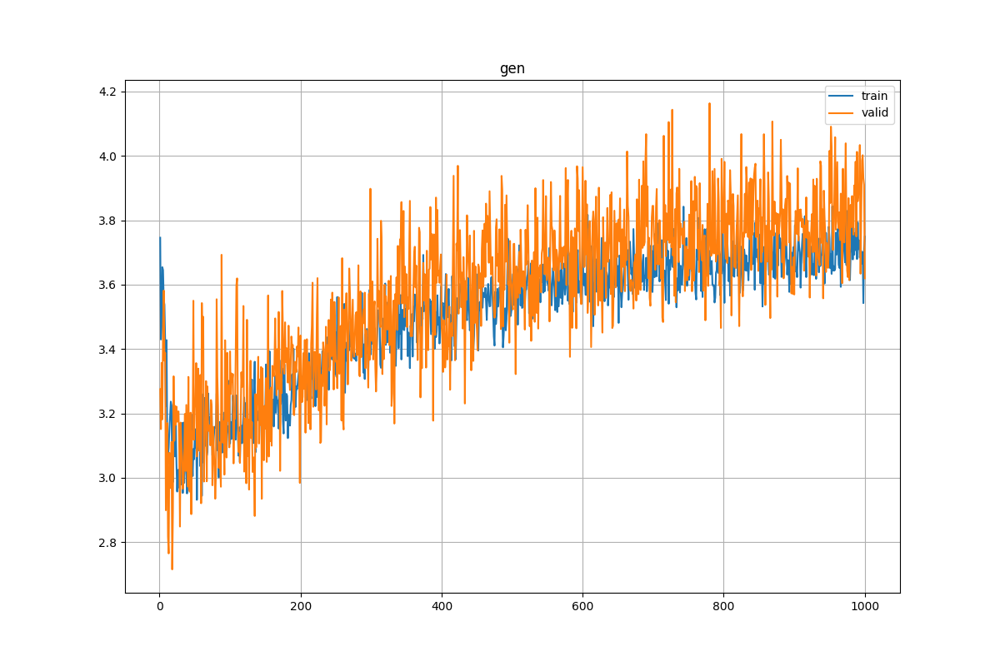
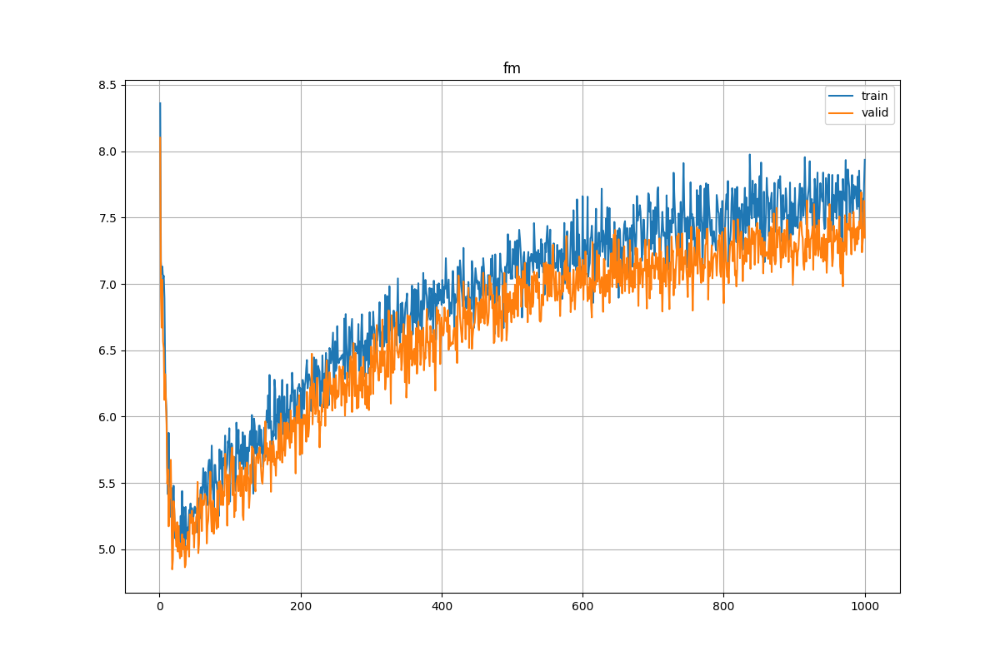
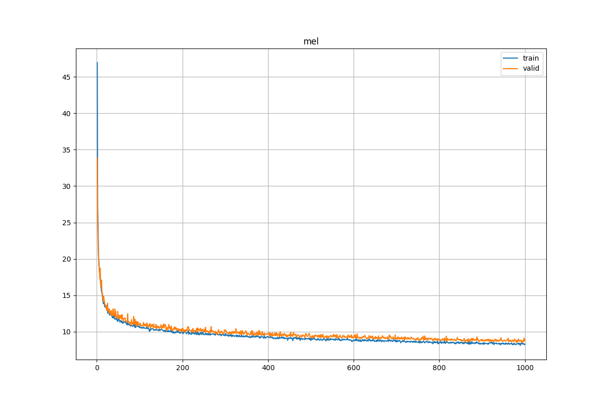

# Vocos

My implementation of Vocos([paper](https://arxiv.org/abs/2306.00814)) for JSUT([link](https://sites.google.com/site/shinnosuketakamichi/publication/jsut)) powerd by lightning.


# Usage
Running run.sh will automatically download the data and begin training.  
So just execute the following commands to begin training.

```sh
cd scripts
./run.sh
```

synthesize.sh uses last.ckpt by default, so if you want to use a specific weight, change it.

```sh
cd scripts
./synthesis.sh
```

# Requirements

```sh
pip install torch torchaudio lightning pandas
```

# Result

Some audio samples are in `asset/sample`.

| loss | plot |
| --- | --- |
| Discriminator |  |
| Generator |  |
| Feature Matching |  |
| Mel |  |

